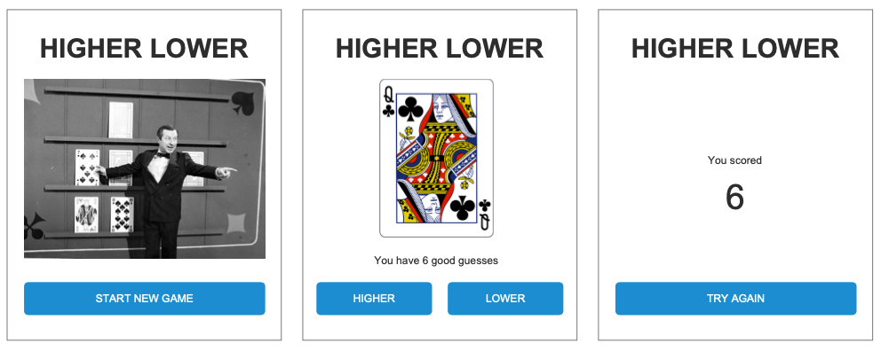

# Technical assessment

Our customer ManyCardz is building a new webshop.
To promote their new card decks, they decided to add small card games to the shop.
In this technical assessment, you have to create a higher lower widget that can be displayed at various places on the webshop.

## Assumptions

As you can see, this repository is still empty.
You can assume that you are building this **reusable component** with **the tools or framework(s) you love to use**.
There is **NO** need to package the project into a npm package. Writing the code is sufficient.


## Mockups



* Images are provided in the `/images` folder.
* The images of the cards are provided through the DeckOfCards API (see chapter "DeckOfCards API")
* Since these are just mockups, you will have to apply a good-looking color scheme / design yourself.

## Functional Requirements:

* An opening screen will invite the customer to come play the higher lower game.
* When starting the game, a new deck will be loaded through the DeckOfCards API.
* On start, a first random card will be picked from the DeckOfCards API.
* The customer can guess that the next card will be Higher Or Lower than the current card.
    * The game will validate if the customer made a correct guess. See the "Game rules" section for more info about the decision logic.
    * When the customer made a correct decision, the next random card will be loaded through the DeckOfCards API.
    * When the customer made an incorrect decision, the customer is wasted and the game will stop.
* The "wasted" screen will display the amount of correct guesses and will invite the customer into restarting a new game.
* Since the game widget can be included in various places, you can assume using a fixed height and a 100% width so that it fits everywhere.

## Game rules

* A shuffled deck of 52 cards is used for the game. 
* Aces are considered the lowest (value of 1)
* Kings are considered the highest (value of 13)
* You need to guess if the value of the next card is higher or lower.
* If you made a correct guess, you need to make another guess for the next card.
* If you made an incorrect guess, the game ends. The score is the amount of cards guessed correctly.
* If the next card has the same value as the previous card, this results in an instant loss. The score is the amount of cards guessed correctly.
* If you are able to guess all cards, the game ends. The customer scores the maximum score!

## DeckOfCards API

Since ManyCardz is going to build many card game widgets, their developers already provided a public API that can be reused for any card game.
You can find more information about the API on the website https://deckofcardsapi.com/.

Important endpoints details for this project:

```
GET https://deckofcardsapi.com/api/deck/new/shuffle/?deck_count=1

> {"success": true, "deck_id": "co159putpo9a", "remaining": 52, "shuffled": true}

GET https://deckofcardsapi.com/api/deck/co159putpo9a/draw/?count=1 

{
  "success": true,
  "deck_id": "co159putpo9a",
  "cards": [
    {
      "code": "5H",
      "image": "https://deckofcardsapi.com/static/img/5H.png",
      "images": {
        "svg": "https://deckofcardsapi.com/static/img/5H.svg",
        "png": "https://deckofcardsapi.com/static/img/5H.png"
      },
      "value": "5",
      "suit": "HEARTS"
    }
  ],
  "remaining": 51
}

> When all cards are drawn:
 
{"success": false, "deck_id": "co159putpo9a", "cards": [], "remaining": 0, "error": "Not enough cards remaining to draw 1 additional"}
```

Values: ACE, 2, 3, 4, 5, 6, 7, 8, 9, 10, JACK, QUEEN, KING


## Practical

### Git

At the end of the assessment, your changes should be available in git.

### Showcase result

TODO : You
> At the end of the assessment, provide the steps on how to see the result.
